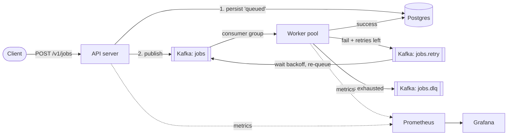

# Conveyor — a distributed job queue on Go + Kafka

[](https://github.com/aryan3650/conveyor/actions/workflows/ci.yml)
[](https://go.dev)
[](https://kafka.apache.org)

Conveyor is a horizontally-scalable background-job system built on **Go** and **Apache Kafka**. Submit a job over HTTP; a pool of workers picks it up from Kafka, runs it, and — if it fails — **retries it with exponential backoff** before finally parking it in a **dead-letter queue**. Every job's lifecycle is tracked in Postgres and every moving part is observable in Grafana.

It's a compact but honest implementation of the patterns real systems (Sidekiq, Celery, Temporal, AWS SQS+Lambda) are built on: **at-least-once delivery, idempotent processing, retries, dead-letter queues, consumer-group scaling, and graceful shutdown.**

---

## Architecture



A job flows: **`queued` → `running` → `succeeded`**, or on repeated failure **`running` → `failed` → (backoff) → … → `dead`**.

---

## Why this is interesting (the engineering, not the demo)

| Concern | How Conveyor handles it |
|--------|--------------------------|
| **At-least-once delivery** | Kafka offsets are committed *manually*, only **after** a job is fully handled. A crash mid-job means the message is redelivered — never silently lost. |
| **Idempotency** (a job must never run twice) | A single atomic SQL `INSERT … ON CONFLICT … WHERE status NOT IN ('succeeded','dead')` **claims** a job. A duplicate delivery for a finished job claims nothing and is skipped. |
| **Retries with backoff** | Failed jobs are republished to `jobs.retry` with a `not_before` timestamp computed as `base · 2^attempt` (capped). A forwarder waits, then re-queues them. |
| **Dead-letter queue** | After `max_retries`, the job is marked `dead` and parked in `jobs.dlq` with its last error, for inspection/replay. |
| **Horizontal scaling** | Workers join a Kafka **consumer group**; Kafka splits the topic's partitions across them. More workers = more throughput, no code change. |
| **Graceful shutdown** | On `SIGTERM`, workers stop fetching and **drain in-flight jobs** (using a shutdown-independent context) before exiting. |
| **Backpressure** | A bounded worker pool (semaphore) caps in-process concurrency so a burst can't exhaust memory or DB connections. |
| **Observability** | Prometheus metrics (throughput, latency histogram, retries, DLQ, in-flight gauge), structured JSON logs, and a provisioned Grafana dashboard. |

---

## Tech stack

- **Go 1.26** — `net/http` (std-lib 1.22 routing), `log/slog` structured logging, `context` everywhere
- **Apache Kafka 3.9** in **KRaft** mode (no ZooKeeper) via [`segmentio/kafka-go`](https://github.com/segmentio/kafka-go)
- **PostgreSQL 16** via [`jackc/pgx/v5`](https://github.com/jackc/pgx) (connection pooling, embedded SQL migrations)
- **Prometheus + Grafana** for metrics and dashboards
- **Docker Compose** one-command local stack; multi-stage **distroless** images
- **GitHub Actions** CI (build, vet, gofmt, race-detector tests against a real Postgres)

---

## Quickstart

**Prerequisites:** Docker + Docker Compose, and Go 1.26 (only if you run the app on your host).

```bash
# 1. Start the infrastructure (Kafka, Postgres, Prometheus, Grafana, Kafka-UI)
make up

# 2. In one terminal: the API server
make api

# 3. In another terminal: a worker
make worker

# 4. Enqueue a job
curl -s -X POST localhost:8080/v1/jobs \
  -H 'Content-Type: application/json' \
  -d '{"type":"send_email","payload":{"to":"you@example.com"}}'
# -> {"id":"…","status":"queued"}

# 5. Check its status
curl -s localhost:8080/v1/jobs/<id>
```

Prefer everything in containers? `docker compose --profile app up -d --build` runs the API and worker as containers too.

### See the moving parts

| Tool | URL | Notes |
|------|-----|-------|
| Kafka-UI | http://localhost:8085 | watch messages flow across `jobs`, `jobs.retry`, `jobs.dlq` |
| Grafana | http://localhost:3300 | dashboard "Conveyor — Distributed Job Queue" (login `admin`/`admin`) |
| Prometheus | http://localhost:9090 | raw metrics & queries |

### Try the interesting paths

```bash
# Retry then succeed: fails twice (1s, 2s backoff), then succeeds
curl -s -X POST localhost:8080/v1/jobs -d '{"type":"charge_payment","payload":{"fail_times":2}}'

# Dead-letter: always fails, give up after 2 retries -> jobs.dlq
curl -s -X POST localhost:8080/v1/jobs -d '{"type":"resize_image","payload":{"fail_always":true},"max_retries":2}'
```

---

## API

| Method | Path | Description |
|--------|------|-------------|
| `POST` | `/v1/jobs` | Enqueue a job. Body: `{"type": "...", "payload": {...}, "max_retries": 5}`. Returns `202` + `{id, status}`. |
| `GET` | `/v1/jobs/{id}` | Fetch a job's full state. `404` if unknown. |
| `GET` | `/v1/stats` | Job counts grouped by status. |
| `GET` | `/healthz` | Liveness probe. |
| `GET` | `/readyz` | Readiness probe (checks Postgres). |
| `GET` | `/metrics` | Prometheus metrics. |

---

## Scaling & load testing

Workers scale by simply running more of them — Kafka rebalances the 6 partitions across the group:

```bash
make worker   # terminal A
make worker   # terminal B  (now 2 workers share the partitions)
```

Generate load with the built-in producer and read throughput off the Grafana dashboard:

```bash
make load N=50000           # blast 50k jobs as fast as possible
go run ./cmd/producer -n 5000 -rate 500   # 5k jobs at a steady 500/sec
```

> **Benchmark:** on a laptop with a single Kafka broker, **one API + one worker** drained **20,000 jobs end-to-end at ~1,460 jobs/sec**, bounded by the durable `acks=all` enqueue path (the safe default). The consume side scales out by adding workers; the enqueue side scales by running more API replicas. Re-run with `make load N=20000` and screenshot the Grafana throughput panel.

---

## Project layout

```
conveyor/
├── cmd/
│   ├── api/        # HTTP front door
│   ├── worker/     # job-processing daemon
│   └── producer/   # load generator / demo CLI
├── internal/
│   ├── job/        # domain types: Job, Status, Message
│   ├── store/      # Postgres persistence + the idempotent Claim
│   ├── queue/      # Kafka adapter: producer, topics, consumer readers
│   ├── worker/     # the engine: consume → run → retry/DLQ, backoff, registry
│   ├── api/        # HTTP handlers (depends on interfaces, fully unit-tested)
│   ├── config/     # 12-factor env configuration
│   └── observability/ # slog + Prometheus metrics
├── migrations/     # embedded SQL schema
├── deploy/         # Prometheus + Grafana provisioning
├── docker-compose.yml
└── Dockerfile      # multi-stage, distroless
```

---

## Design decisions & trade-offs

- **Kafka is the work queue; Postgres is the source of truth for *state*.** Kafka is great at durable, ordered, partitioned delivery but bad at "what's the status of job X?". Postgres answers that cheaply. They play to their strengths.
- **`segmentio/kafka-go`** over `franz-go`/`confluent-kafka-go`: a pure-Go, highly readable API. For a system whose code is meant to be *read*, clarity beat the raw throughput edge of the alternatives. (Swappable behind the `queue` package.)
- **Concurrency + correctness:** workers process messages concurrently and commit per-message. Out-of-order commits could in theory cause a redelivery — but the idempotent `Claim` makes redelivery harmless, so we get throughput *and* correctness.
- **Delayed retries** are done with a retry topic + a forwarder that honors a `not_before` timestamp, because Kafka has no native per-message delay. Simple and easy to reason about; trade-off is the forwarder processes due-times roughly in order.
- **Std-lib HTTP routing** (Go 1.22+) instead of a framework — fewer dependencies, and it shows command of modern Go.

### Known limitations / next steps
- **Enqueue is not transactional across Postgres + Kafka.** A crash between the DB insert and the Kafka publish could orphan a `queued` row. The production fix is the **transactional outbox** pattern (write to an outbox table in the same tx, relay to Kafka) — a natural next iteration.
- Add a `POST /v1/dlq/{id}/replay` endpoint to re-drive dead jobs.
- Add jitter to backoff to avoid retry thundering-herds.
- Per-job-type concurrency limits and priorities.

---

## Testing

```bash
make test        # unit + integration tests
make test-race   # with the race detector
```

Unit tests cover the backoff math, domain logic, and the HTTP handlers (via in-memory fakes — the API depends on interfaces, not concrete types). Integration tests exercise the real Postgres `Claim` idempotency guard; they auto-skip if no database is reachable, and run against a real Postgres service in CI.

---

## License

MIT
